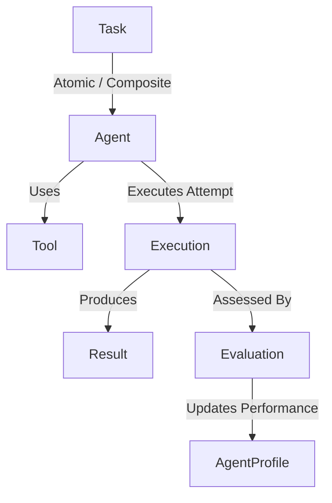
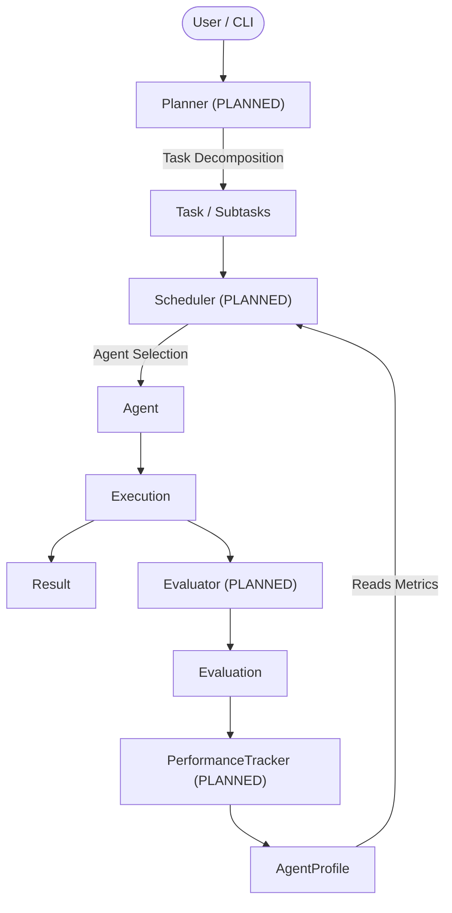

# ABOS Architecture

This document reflects the **actual implemented architecture** of ABOS v0.2.

## System Overview

ABOS v0.2 establishes seven canonical core domain contracts. The architecture strictly decouples domain objects from infrastructure concerns and external frameworks (such as LangGraph, FastAPI, LiteLLM, or databases).

## Canonical Core Domain Contracts (`core/`)

### 1. Task (`core/task.py`) [IMPLEMENTED]
- Unit of work requested within ABOS. Supports both atomic tasks and composite task hierarchies.
- Attributes: `id`, `description`, `input_data`, `priority` (`TaskPriority`), `required_capabilities`, `status` (`TaskStatus`), `assigned_agent_id`, `parent_task_id`, `child_task_ids`, `created_at`, `metadata`, `result`.
- Enforces data structure for task decomposition without containing decomposition or planning logic.

### 2. Agent (`core/agent.py`) [IMPLEMENTED]
- Abstract base contract (`BaseAgent`) for all ABOS execution entities.
- Attributes: `id`, `name`, `capabilities`, `state` (`AgentState`).
- Method: `execute(task: Task) -> Result`.

### 3. Tool (`core/tool.py`) [IMPLEMENTED]
- Abstract base interface (`BaseTool`) for external capabilities accessible to agents.
- Attributes: `name`, `description`, `input_schema`.
- Method: `execute(**kwargs) -> Any`.

### 4. Result (`core/result.py`) [IMPLEMENTED]
- Structured outcome of a task execution produced by an Agent.
- Attributes: `success` (bool), `output` (Any), `error` (Optional[str]), `agent_id` (str), `execution_id` (Optional[str]), `metadata` (dict).
- **Separation of Concerns**: Does NOT contain quality scores, correctness scores, or agent performance metrics (which belong to `Evaluation` / `AgentProfile`).

### 5. Execution (`core/execution.py`) [IMPLEMENTED]
- Represents ONE specific attempt to execute ONE Task. A single Task may have multiple Executions across retries or recovery attempts.
- Attributes: `id`, `task_id`, `agent_id`, `status` (`ExecutionStatus`), `started_at`, `completed_at`, `result`, `attempt_number`, `error`, `metadata`.

### 6. Evaluation (`core/evaluation.py`) [IMPLEMENTED]
- Represents ABOS's assessment of an Execution. Produced independently of the Agent's Result.
- Attributes: `id`, `execution_id`, `task_id`, `agent_id`, `success`, `quality_score` (0..1), `correctness_score` (0..1), `latency_ms` (non-negative), `feedback`, `error_type`, `evaluator`, `created_at`, `metadata`.

### 7. AgentProfile (`core/agent_profile.py`) [IMPLEMENTED]
- Historical quantitative performance information about an Agent, used by future schedulers for performance-based agent selection.
- Attributes: `agent_id`, `total_executions`, `successful_executions`, `success_rate` (0..1), `avg_latency_ms`, `confidence_score` (default 0.5), `capabilities`, `last_execution_at`, `metadata`.

### 8. Orchestrator (`core/orchestrator.py`) [IMPLEMENTED]
- Central coordinator maintaining agent registration and capability matching for task routing in v0.1/v0.2.

---

## Future Architecture & Integration Points (NOT YET IMPLEMENTED)

The following components represent future architecture and are **NOT YET IMPLEMENTED** in this repository:

- **Planner / Task Decomposition Engine** [PLANNED - v0.3]
- **Advanced Capability & Performance Scheduler** [PLANNED - v0.4]
- **Evaluator Service & PerformanceTracker** [PLANNED - v0.5]
- **Recovery & Persistent Memory** [PLANNED - v0.6]
- **LangGraph Workflow Orchestration** [PLANNED - v0.7]
- **FastAPI / LiteLLM / PostgreSQL / Redis Integration** [PLANNED - Later]
