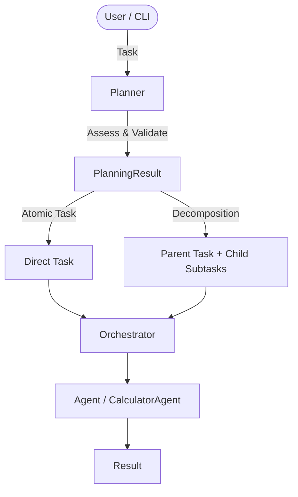
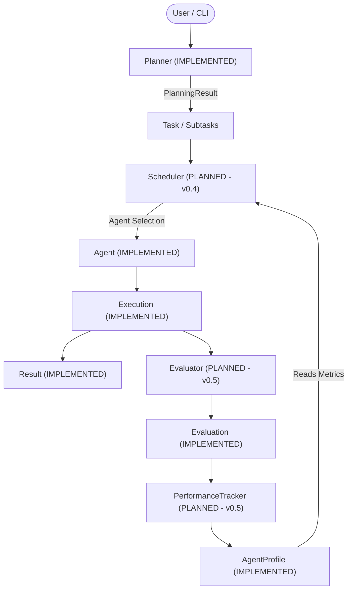

# ABOS Architecture

This document reflects the **actual implemented architecture** of ABOS v0.3.

## System Overview

ABOS v0.3 establishes a modular orchestration layer featuring the **Planner** and **Task Decomposition** subsystem on top of the framework-independent domain layer.

---

## 1. Orchestration Layer (`orchestration/`)

### Planner Contract (`orchestration/planner/base.py`) [IMPLEMENTED]
- Abstract base class (`BasePlanner` / `Planner`) defining the contract: `plan(task: Task) -> PlanningResult`.
- **Responsibilities**:
  - Assess whether task decomposition is beneficial.
  - Leave atomic tasks intact (`should_decompose=False`, `subtasks=[]`).
  - Generate sequential subtasks when decomposition is appropriate (`should_decompose=True`).
  - Establish parent-child task relationships (`parent_task_id`, `child_task_ids`).
  - Validate decomposition integrity.
  - Return a structured `PlanningResult`.
- **Non-Responsibilities** (strictly out of scope for Planner):
  - Selecting agents for subtasks (leaves `assigned_agent_id = None`).
  - Executing tasks or agents.
  - Evaluating execution results.
  - Managing memory, recovery, or LangGraph state.

### PlanningResult (`orchestration/planner/base.py`) [IMPLEMENTED]
- Structured planning decision container.
- Attributes: `task_id`, `should_decompose` (bool), `subtasks` (List[Task]), `reason` (str), `confidence` (0..1), `valid` (bool), `metadata` (dict).

### DeterministicPlanner (`orchestration/planner/deterministic.py`) [IMPLEMENTED]
- Rule-based, explainable decomposition engine.
- Decomposes explicit multi-step instructions (e.g. numbered lists, semicolon sequences, sequential connectives, Oxford comma conjunction lists).
- Leaves single/atomic instructions unchanged.

### DecompositionValidator (`orchestration/planner/validator.py`) [IMPLEMENTED]
- Validates decomposition structure:
  - Produces at least one child task.
  - Child IDs are unique and non-empty.
  - Child IDs differ from parent ID.
  - Every child has `child.parent_task_id == parent.id`.
  - Parent `child_task_ids` matches generated subtasks.
  - Child descriptions are non-empty.
  - `assigned_agent_id` is NOT set by the Planner.

### Orchestrator (`core/orchestrator.py`) [IMPLEMENTED]
- Central coordinator maintaining agent registration and capability-based task execution for atomic tasks.

---

## 2. Canonical Core Domain Contracts (`core/`)

1. **Task (`core/task.py`)** [IMPLEMENTED]: Unit of work with parent/child hierarchical support (`parent_task_id`, `child_task_ids`).
2. **Agent (`core/agent.py`)** [IMPLEMENTED]: Abstract contract (`BaseAgent`) with `execute(task: Task) -> Result`.
3. **Tool (`core/tool.py`)** [IMPLEMENTED]: Abstract contract (`BaseTool`) for external capabilities.
4. **Result (`core/result.py`)** [IMPLEMENTED]: Structured outcome of execution produced by an Agent.
5. **Execution (`core/execution.py`)** [IMPLEMENTED]: Single execution attempt of a Task.
6. **Evaluation (`core/evaluation.py`)** [IMPLEMENTED]: Separate assessment of an Execution.
7. **AgentProfile (`core/agent_profile.py`)** [IMPLEMENTED]: Historical quantitative performance record.

---

## 3. Future Architecture (NOT YET IMPLEMENTED)

- **Scheduler & Performance-Based Agent Selection** [PLANNED - v0.4]
- **Evaluator Service & PerformanceTracker Adaptive Loop** [PLANNED - v0.5]
- **Recovery System & Persistent Memory** [PLANNED - v0.6]
- **LangGraph Workflow Orchestration** [PLANNED - v0.7]
- **FastAPI / LiteLLM / PostgreSQL / Redis Integration** [PLANNED - Later]
