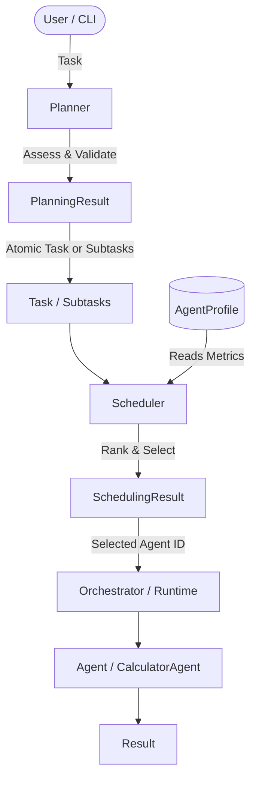
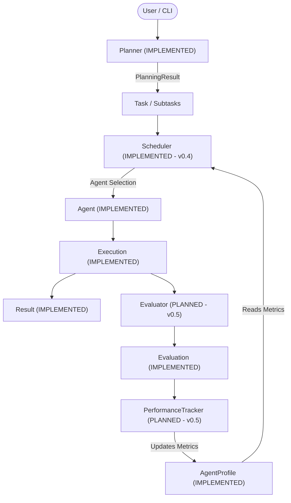

# ABOS Architecture

This document reflects the **actual implemented architecture** of ABOS v0.4.

## System Overview

ABOS v0.4 establishes a modular orchestration layer featuring the **Planner** (task decomposition) and **Scheduler** (performance-aware agent selection) subsystems on top of the framework-independent domain layer.

---

## 1. Orchestration Layer (`orchestration/`)

### Planner Subsystem (`orchestration/planner/`) [IMPLEMENTED]
- **`Planner` (`BasePlanner`) (`orchestration/planner/base.py`)**: Abstract base class defining `plan(task: Task) -> PlanningResult`.
- **`PlanningResult` (`orchestration/planner/base.py`)**: Structured planning decision container (`task_id`, `should_decompose`, `subtasks`, `reason`, `confidence`, `valid`, `metadata`).
- **`DeterministicPlanner` (`orchestration/planner/deterministic.py`)**: Rule-based decomposition engine for explicit multi-step sequences.
- **`DecompositionValidator` (`orchestration/planner/validator.py`)**: Validates parent-child integrity, ID uniqueness, and agent-assignment isolation.

### Scheduler Subsystem (`orchestration/scheduler/`) [IMPLEMENTED]
- **`Scheduler` (`BaseScheduler`) (`orchestration/scheduler/base.py`)**: Abstract base class defining `schedule(task: Task, agents: List[BaseAgent], profiles: Optional[List[AgentProfile]] = None) -> SchedulingResult`.
- **`CandidateScore` (`orchestration/scheduler/base.py`)**: Structured record of candidate evaluation (`agent_id`, `total_score`, `success_rate`, `latency_score`, `confidence_score`, `raw_latency_ms`, `eligible`, `rejection_reason`).
- **`SchedulingResult` (`orchestration/scheduler/base.py`)**: Structured container communicating the scheduling decision (`task_id`, `selected_agent_id`, `success`, `reason`, `score`, `candidates`, `metadata`).
- **`ScoringPolicy` (`orchestration/scheduler/scoring.py`)**: Configurable weighting policy (`success_rate_weight=0.50`, `latency_weight=0.20`, `confidence_weight=0.30`) with strict non-negative and sum-to-1.0 validation, and inverted min-max latency normalization.
- **`DeterministicScheduler` (`orchestration/scheduler/deterministic.py`)**: Deterministic agent selection engine executing the complete pipeline:
  1. **Capability Filtering**: Rejects agents lacking required capabilities (`required_capabilities ⊆ agent.capabilities`).
  2. **State Filtering**: Rejects non-`IDLE` agents (`BUSY`, `ERROR`, `TERMINATED`).
  3. **Profile Lookup**: Reads historical metrics from `AgentProfile` (or applies neutral defaults `success=0.5, conf=0.5, lat=0.5` if missing).
  4. **Performance Scoring**: Applies `ScoringPolicy` formula:
     `score = (success_rate * w_success) + (latency_score * w_latency) + (confidence_score * w_conf)`.
  5. **Deterministic Multi-Tier Tie-Breaking**:
     - Highest total score
     - Highest success rate
     - Highest confidence score
     - Lowest raw average latency
     - Ascending lexicographical agent ID
  6. **Structured Decision**: Returns `SchedulingResult` with full candidate breakdown.
- **Scheduler Non-Responsibilities**:
  - Does NOT mutate `Task`, `Agent`, or `AgentProfile` (e.g., does not set `task.assigned_agent_id` or agent state).
  - Does NOT execute tasks or agents.
  - Does NOT update `AgentProfile` historical records (reserved for v0.5 `PerformanceTracker`).

### Orchestrator (`core/orchestrator.py`) [IMPLEMENTED]
- Central coordinator maintaining agent registration and capability-based task execution for atomic tasks.

---

## 2. Canonical Core Domain Contracts (`core/`)

1. **Task (`core/task.py`)** [IMPLEMENTED]: Unit of work with parent/child hierarchical support (`parent_task_id`, `child_task_ids`).
2. **Agent (`core/agent.py`)** [IMPLEMENTED]: Abstract contract (`BaseAgent`) with `execute(task: Task) -> Result` and operational state (`IDLE`, `BUSY`, `ERROR`, `TERMINATED`).
3. **Tool (`core/tool.py`)** [IMPLEMENTED]: Abstract contract (`BaseTool`) for external capabilities.
4. **Result (`core/result.py`)** [IMPLEMENTED]: Structured outcome of execution produced by an Agent.
5. **Execution (`core/execution.py`)** [IMPLEMENTED]: Single execution attempt of a Task.
6. **Evaluation (`core/evaluation.py`)** [IMPLEMENTED]: Separate assessment of an Execution.
7. **AgentProfile (`core/agent_profile.py`)** [IMPLEMENTED]: Historical quantitative performance record.

---

## 3. Future Architecture (NOT YET IMPLEMENTED)

- **Evaluator Service & PerformanceTracker Adaptive Loop** [PLANNED - v0.5]
- **Recovery System & Persistent Memory** [PLANNED - v0.6]
- **LangGraph Workflow Orchestration** [PLANNED - v0.7]
- **LLM-Based Planner Integration** [PLANNED - v0.8]
- **FastAPI / LiteLLM / PostgreSQL / Redis Integration** [PLANNED - Later]
