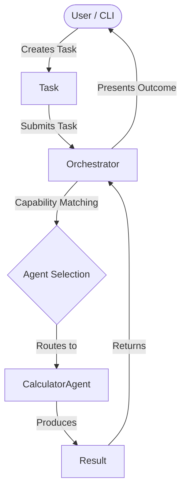

# ABOS Architecture

This document reflects the **actual implemented architecture** of ABOS v0.1.

## System Overview

ABOS v0.1 implements a clean, modular foundation for agent-based execution. The architecture decouples tasks, agents, tools, and execution outcomes.

## Core Abstractions

### 1. Task (`core/task.py`)
- Represents unit of work requested by a user or system process.
- Attributes: `id`, `description`, `priority`, `status` (`TaskStatus`), `input_data`, `result`.
- Completely agent-agnostic.

### 2. Agent (`core/agent.py`)
- Abstract base class (`BaseAgent`) defining the capability and execution contract.
- Attributes: `id`, `name`, `capabilities`, `state` (`AgentState`).
- Method: `execute(task: Task) -> Result`.
- Independent of LLM or external frameworks.

### 3. Tool (`core/tool.py`)
- Abstract base interface (`BaseTool`) for external utilities accessible to agents.
- Attributes: `name`, `description`, `input_schema`.
- Method: `execute(**kwargs) -> Any`.

### 4. Result (`core/result.py`)
- Structured output container returned by any execution path.
- Attributes: `success` (bool), `output` (Any), `error` (Optional[str]), `agent_id` (str), `metadata` (dict).

### 5. Orchestrator (`core/orchestrator.py`)
- Central coordinator maintaining agent registry.
- Responsibilities: Agent registration, capability matching, task routing, exception capture into `Result`.

## Data Flow & Task Lifecycle

1. `Task` is instantiated with `input_data` and registered parameters.
2. `Orchestrator.execute_task(task)` is invoked.
3. Orchestrator inspects registered agents' `capabilities`.
4. Orchestrator selects a matching agent (e.g., `CalculatorAgent` for capability `"math"`).
5. Orchestrator sets `Task` status to `IN_PROGRESS` and calls `agent.execute(task)`.
6. Agent performs logic and constructs a structured `Result`.
7. Orchestrator attaches `Result` to `task.result`, updates status (`COMPLETED` or `FAILED`), and returns `Result`.

## Extension Points
- **New Agents**: Subclass `BaseAgent` and declare custom capabilities.
- **New Tools**: Subclass `BaseTool` to wrap external API endpoints, filesystem actions, or parsers.
- **Advanced Orchestration**: Extend `Orchestrator` to support dynamic fallback strategies, parallel execution, or planning.
